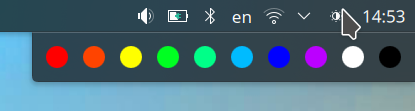

# BT Lights Widget KDE

Widget for taskbar in KDE / Linux that offers colors for generic Bluetooth lights on left click.



Bluetooth Low Energy lights that accept characteristic `0x0009` value `56[red][green][blue]00f0aa` are supported. 
Minimal implementation - see Configure below.


## Install

Requirements: presence of `gatttool` package.

### Get the source code

```bash
git clone https://github.com/alex-vt/BT-Lights-Widget-KDE
cd BT-Lights-Widget-KDE
```

### Configure

In `package/contents/main.qml`, replace line 15 with the Bluetooth MAC address of supported lights. 
Or comma-separated multiple addresses. Example of a MAC address: `"01:23:45:AB:CD:EF"`.

_Optionally_, also change color presets just below the MAC addresses. A preset consist of hexadecimal values 
of red, green and blue corresponding color component brightnesses, from `00` to `ff`. 
With all color component values `00`, light can be considered off.

Supported lights can be tested with the `gatttool` command line command. 
For a light with the example MAC address `"01:23:45:AB:CD:EF"` the commands for colors will be:

| Color     | Preset     | `gatttool` example command                                                   |
|-----------|------------|------------------------------------------------------------------------------|
| Light off | `"000000"` | `gatttool -b 01:23:45:AB:CD:EF --char-write-req -a 0x0009 -n 5600000000f0aa` |
| Red       | `"ff0000"` | `gatttool -b 01:23:45:AB:CD:EF --char-write-req -a 0x0009 -n 56ff000000f0aa` |
| Green     | `"00ff00"` | `gatttool -b 01:23:45:AB:CD:EF --char-write-req -a 0x0009 -n 5600ff0000f0aa` |
| Blue      | `"0000ff"` | `gatttool -b 01:23:45:AB:CD:EF --char-write-req -a 0x0009 -n 560000ff00f0aa` |
| White     | `"ffffff"` | `gatttool -b 01:23:45:AB:CD:EF --char-write-req -a 0x0009 -n 56ffffff00f0aa` |

### Install the widget

```bash
kpackagetool5 --install package
```

Right click on taskbar, click Add widgets, 
click BT Lights Widget or drag it to preferable place on the taskbar. 


## License

[MIT](LICENSE) license.
